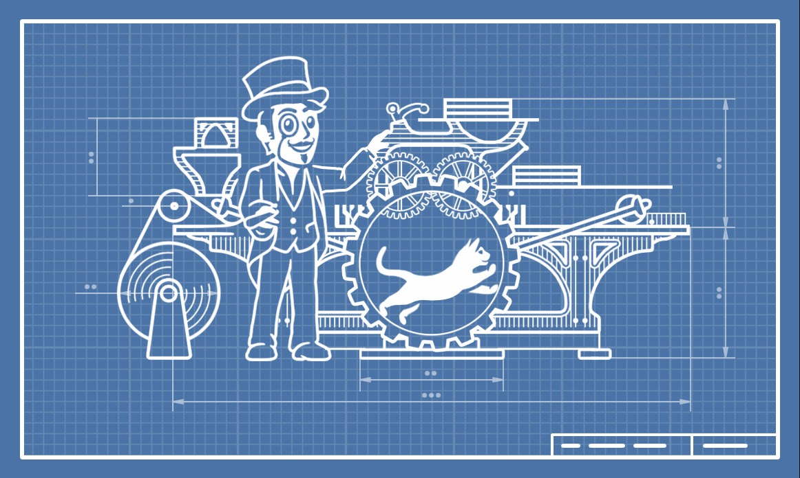

# telegraph [](https://pkg.go.dev/source.toby3d.me/toby3d/telegraph)


Простой пакет [с минимумом официальных зависимостей](../go.mod) для работы с [Telegraph API](https://telegra.ph/api).

Загрузите:
```bash
$ go get -u source.toby3d.me/toby3d/telegraph
```

Импортируйте:
```
import "source.toby3d.me/toby3d/telegraph"
```

Заполните структуры команд и вызовите их:
```go
package telegraph_test

import (
  "context"
  "fmt"
  "log"
  "net/http"

  "source.toby3d.me/toby3d/telegraph"
)

func Must[T any](v T, err error) T {
  if err != nil {
    panic(err)
  }

  return v
}

func main() {
  client := http.DefaultClient

  account, err := telegraph.CreateAccount{
    AuthorURL:  nil,
    AuthorName: Must(telegraph.NewAuthorName("Anonymous")),
    ShortName:  *Must(telegraph.NewShortName("Sandbox")),
  }.Do(context.Background(), client)
  if err != nil {
    log.Fatalln("cannot create account:", err)
  }

  page, err := telegraph.CreatePage{
    AuthorURL:   nil,
    AccessToken: account.AccessToken,
    Title:       *Must(telegraph.NewTitle("Sample Page")),
    AuthorName:  &account.AuthorName,
    Content: []telegraph.Node{{
      Element: &telegraph.NodeElement{
        Tag:      telegraph.P,
        Children: []telegraph.Node{{Text: "Hello, World!"}},
      },
    }},
    ReturnContent: true,
  }.Do(context.Background(), client)
  if err != nil {
    log.Fatalln("cannot create page:", err)
  }

  fmt.Printf("'%s' by %s\n%s", page.Title, page.AuthorName, page.Content[0])
  // 'Sample Page' by Anonymous
  // <p>Hello, World!</p>
}
```

Если вам понадобится помощь, [напишите мне](mailto:support@toby3d.me?subject=Telegraph). Если вы хотите помочь мне, [пришлите пожертвование](https://toby3d.me/en/pay).